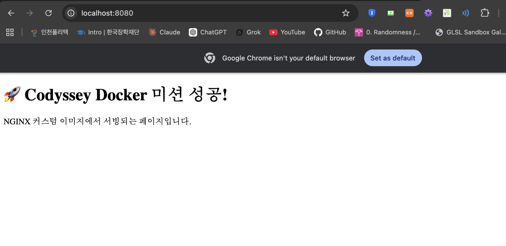
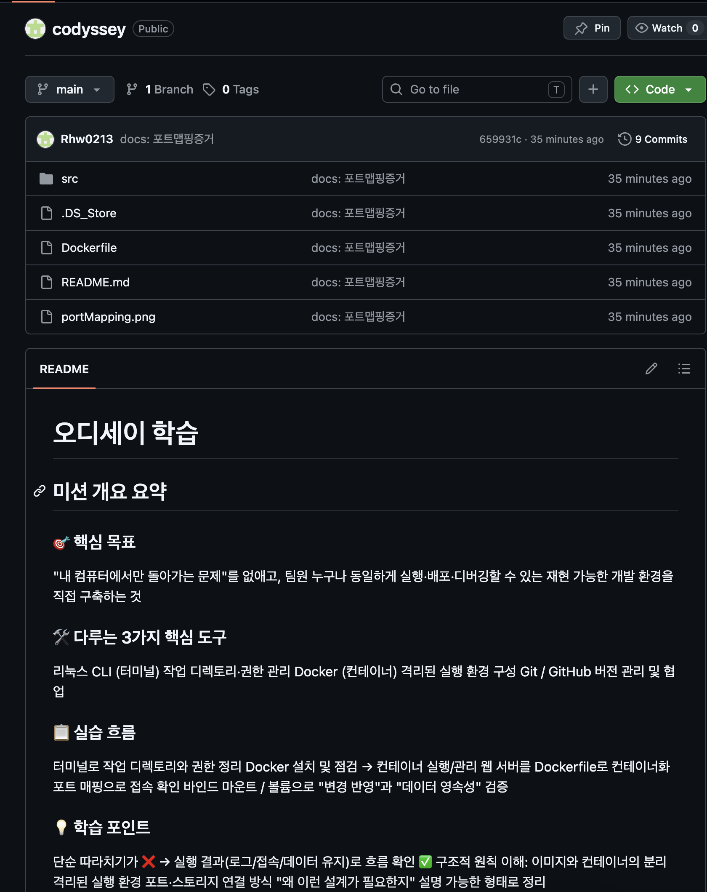

# 개발 워크스테이션 구축

> Codyssey 미션 — 리눅스 CLI · Docker · Git/GitHub로 **재현 가능한 개발 환경** 구축

---

## 1. 프로젝트 개요

### 1.1 미션 목표

코드가 **"내 컴퓨터에서만" 돌아가는 문제를 줄이고**, 팀원 누구나 같은 방식으로 실행·배포·디버깅할 수 있는 환경을 직접 구성한다.

| 도구 | 역할 |
|---|---|
| 리눅스 CLI (터미널) | 작업 디렉토리 · 권한 관리 |
| Docker (컨테이너) | 격리된 실행 환경 구성 |
| Git / GitHub | 버전 관리 및 협업 |

### 1.2 접근 방식

실행 결과(로그 / 접속 / 데이터 유지)로 흐름을 확인하고, 아래 구조적 원칙을 "왜 필요한지" 설명 가능한 형태로 정리한다.

- 이미지와 컨테이너의 분리
- 격리된 실행 환경
- 포트 · 스토리지 연결 방식

개념 정리는 **[19. 학습 정리](#19-학습-정리)** 에 모았다.

---

## 2. 실행 환경

```console
rhw02133670@c4r1s8 codyssey % sw_vers
ProductName:		macOS
ProductVersion:		15.7.4
BuildVersion:		24G517

rhw02133670@c4r1s8 codyssey % echo $SHELL
/bin/zsh

rhw02133670@c4r1s8 codyssey % docker --version
Docker version 28.5.2, build ecc6942

rhw02133670@c4r1s8 codyssey % git --version
git version 2.53.0
```

| 항목 | 값 |
|---|---|
| OS | macOS 15.7.4 (Build 24G517) |
| 쉘 | zsh |
| 컨테이너 런타임 | OrbStack |
| Docker 버전 | 28.5.2 |
| Git 버전 | 2.53.0 |

**OrbStack을 쓰는 이유:** 서울캠퍼스는 보안 정책상 `sudo` 사용이 제한되어 Docker를 직접 설치하거나 데몬을 제어하기 어렵다. OrbStack은 `sudo` 없이 컨테이너를 실행·관리할 수 있게 해주며, 앱을 실행하면 내부적으로 Docker 엔진이 함께 구동되어 터미널에서는 `docker run`, `docker ps`, `docker build` 등을 **기존과 동일하게** 사용할 수 있다.

---

## 3. 수행 항목 체크리스트

### 3.1 필수 요구사항

| # | 항목 | 위치 |
|---|---|---|
| **문서** | | |
| 1 | 제출 저장소 공개 생성 | [14.3](#143-github-연동-증거) |
| 2 | 프로젝트 개요 | [1](#1-프로젝트-개요) |
| 3 | 실행 환경 (OS/쉘, Docker·Git 버전) | [2](#2-실행-환경) |
| 4 | 수행 항목 체크리스트 | 이 표 |
| 5 | 검증 방법 + 증거 링크 | [4](#4-검증-방법) |
| 6 | 명령/출력 코드블록 정리 | 문서 전체 |
| 7 | 트러블슈팅 5건 | [15](#15-트러블슈팅) |
| **터미널 조작** | | |
| 8 | 현재 위치 확인 (`pwd`) | [5.1](#51-경로--목록--이동) |
| 9 | 목록 확인 — 숨김 포함 (`ls -al`) | [5.1](#51-경로--목록--이동) |
| 10 | 이동 (`cd`) | [5.1](#51-경로--목록--이동) |
| 11 | 생성 (`mkdir` / `touch`) | [5.2](#52-생성--복사--이름변경--삭제) |
| 12 | 복사 (`cp`) | [5.2](#52-생성--복사--이름변경--삭제) |
| 13 | 이동/이름변경 (`mv`) | [5.2](#52-생성--복사--이름변경--삭제) |
| 14 | 삭제 (`rm`, `rm -r`) | [5.2](#52-생성--복사--이름변경--삭제) |
| 15 | 파일 내용 확인 (`cat`) | [5.2](#52-생성--복사--이름변경--삭제) |
| 16 | 빈 파일 생성 (`touch`) | [5.2](#52-생성--복사--이름변경--삭제) |
| **권한** | | |
| 17 | 파일 1개 권한 변경 전/후 | [6.1](#61-파일-권한-변경-전후) |
| 18 | 디렉토리 1개 권한 변경 전/후 | [6.2](#62-디렉토리-권한과-재귀-변경) |
| **Docker 점검** | | |
| 19 | `docker --version` | [2](#2-실행-환경) |
| 20 | `docker info` (데몬 동작 확인) | [7](#7-docker-설치-및-기본-점검) |
| **Docker 운영** | | |
| 21 | 이미지 다운로드 (`docker pull`) | [8.2](#82-이미지-다운로드) |
| 22 | 이미지 목록 (`docker images`) | [8.3](#83-이미지-목록) |
| 23 | 컨테이너 실행 (`docker run`) | [8.4](#84-컨테이너-실행) |
| 24 | 컨테이너 중지 (`docker stop`) | [8.6](#86-컨테이너-중지-및-전체-목록) |
| 25 | 컨테이너 목록 (`docker ps`) | [8.5](#85-실행-중인-컨테이너-목록) |
| 26 | 컨테이너 전체 목록 (`docker ps -a`) | [8.6](#86-컨테이너-중지-및-전체-목록) |
| 27 | 로그 확인 (`docker logs`) | [8.7](#87-로그-확인) |
| 28 | 리소스 확인 (`docker stats`) | [8.8](#88-리소스-확인) |
| **컨테이너 실습** | | |
| 29 | `hello-world` 실행 성공 | [9.1](#91-hello-world) |
| 30 | `ubuntu` 진입 + `ls` | [9.2](#92-ubuntu-컨테이너-진입) |
| 31 | `ubuntu` 진입 + `echo` | [9.2](#92-ubuntu-컨테이너-진입) |
| 32 | attach / exec 차이 관찰 정리 | [9.3](#93-attach-와-exec-의-차이) |
| **커스텀 이미지** | | |
| 33 | 베이스 이미지 선택 근거 기술 (NGINX) | [10.1](#101-베이스-선택과-커스텀-포인트) |
| 34 | 커스텀 포인트별 목적 기술 | [10.1](#101-베이스-선택과-커스텀-포인트) |
| 35 | 빌드 성공 + 실행 성공 | [10.3](#103-빌드-결과) |
| **포트 · 스토리지** | | |
| 36 | 포트 매핑 접속 증거 (주소창 포함) | [11](#11-포트-매핑-및-접속-증거) |
| 37 | 바인드 마운트 변경 전/후 비교 | [12](#12-바인드-마운트--변경-반영-검증) |
| 38 | 볼륨 생성/연결/검증 | [13](#13-docker-볼륨--영속성-검증) |
| 39 | 컨테이너 삭제 전/후 데이터 비교 | [13.3](#133-전후-비교-및-결론) |
| **Git · 보안** | | |
| 40 | `git config --list` 기록 | [14.1](#141-설정-확인) |
| 41 | GitHub 저장소 연동 증거 | [14.3](#143-github-연동-증거) |
| 43 | 민감정보 마스킹 | [18.2](#182-민감정보-처리) |

### 3.2 보너스 요구사항

| # | 항목 | 위치 |
|---|---|---|
| B1 | Compose 단일 서비스 실행 | [16.1](#161-단일-서비스) |
| B2 | Compose 멀티 컨테이너 + 통신 확인 | [16.2](#162-멀티-컨테이너와-통신) |
| B3 | 운영 명령 (`up`/`down`/`ps`/`logs`) | [16.3](#163-운영-명령) |
| B4 | 환경 변수 주입 | [16.4](#164-환경-변수) |
| B5 | SSH 키 등록 및 푸시 동작 확인 | [17](#17-github-ssh-키-설정) |


---

## 4. 검증 방법

| 검증 대상 | 사용 명령 | 판정 근거 | 결과 위치 |
|---|---|---|---|
| 데몬 동작 | `docker info` | `Server` 섹션 출력 (`Server Version: 28.5.2`) | [7](#7-docker-설치-및-기본-점검) |
| 권한 변경 적용 | `chmod` → `ls -l` | `-rw-r--r--` → `-rwx------` 변화 | [6.1](#61-파일-권한-변경-전후) |
| 재귀 권한 적용 | `chmod -R` → `ls -al` | 하위 항목까지 `drwxr-xr-x` | [6.2](#62-디렉토리-권한과-재귀-변경) |
| Docker 정상 동작 | `docker run hello-world` | `Hello from Docker!` 출력 | [9.1](#91-hello-world) |
| 격리된 실행 환경 | `docker run -it ubuntu /bin/bash` | 호스트와 다른 독립 파일시스템 | [9.2](#92-ubuntu-컨테이너-진입) |
| 컨테이너 수명 | `docker exec` / `docker attach` 후 `docker ps` | exec 후 `Up`, attach 후 목록 비어짐 | [9.3](#93-attach-와-exec-의-차이) |
| 커스텀 이미지 생성 | `docker build` → `docker images` | `writing image sha256:f8532955e1df` 와 `IMAGE ID` 일치 | [10.3](#103-빌드-결과) |
| 포트 매핑 접속 | `docker run -p 8080:80` → 브라우저 | 주소창 `localhost:8080` + 커스텀 페이지 | [11](#11-포트-매핑-및-접속-증거) |
| 변경 반영 (바인드 마운트) | 호스트 파일 수정 → `curl` | 재빌드 없이 응답 변화 (403 → 수정 내용) | [12.3](#123-전후-비교) |
| 데이터 영속성 (볼륨) | `docker rm` 후 새 컨테이너에서 `cat` | 삭제 후에도 `data` 출력 | [13.3](#133-전후-비교-및-결론) |
| 컨테이너 간 통신 | `nslookup cache` / `curl web` | 서비스명으로 IP 해석 + HTTP 200 | [16.2](#162-멀티-컨테이너와-통신) |
| 통신 수신 확인 | `docker-compose logs` | 받는 쪽 로그에 `"GET / HTTP/1.1" 200` | [16.3](#163-운영-명령) |
| 환경변수 주입 | `docker-compose logs app` | `포트는 5000, 모드는 development` | [16.4](#164-환경-변수) |
| SSH 인증 | `ssh -T git@github.com` | `Hi Rhw0213!` 응답 | [17.4](#174-인증-확인) |
| SSH 푸시 | `git push` | `To github.com:Rhw0213/codyssey.git` | [17.5](#175-ssh-푸시-전환) |

---

## 5. 터미널 조작 로그

### 5.1 경로 · 목록 · 이동

```console
rhw02133670@c4r1s8 codyssey % pwd
/Users/rhw02133670/codyssey

rhw02133670@c4r1s8 codyssey % ls -al
total 24
drwxr-xr-x   5 rhw02133670  rhw02133670   160 Jul 28 11:20 .
drwxr-x---+ 23 rhw02133670  rhw02133670   736 Jul 28 11:13 ..
-rw-r--r--@  1 rhw02133670  rhw02133670  6148 Jul 28 11:10 .DS_Store
drwxr-xr-x  13 rhw02133670  rhw02133670   416 Jul 28 10:57 .git
-rw-r--r--   1 rhw02133670  rhw02133670  1260 Jul 28 10:41 README.md
```

| 명령 | 확인한 것 |
|---|---|
| `pwd` | 현재 작업 디렉토리의 **절대 경로** |
| `ls -al` | 숨김 파일(`.git`, `.DS_Store`)까지 포함한 상세 목록 |

### 5.2 생성 · 복사 · 이름변경 · 삭제

```console
rhw02133670@c4r1s8 codyssey % mkdir test
rhw02133670@c4r1s8 codyssey % cd test

rhw02133670@c4r1s8 test % touch hello.txt
rhw02133670@c4r1s8 test % cat hello.txt

rhw02133670@c4r1s8 test % mv hello.txt hi.txt
rhw02133670@c4r1s8 test % mv hi.txt hi_backup.txt

rhw02133670@c4r1s8 test % cp hi_backup.txt hi.txt
rhw02133670@c4r1s8 test % rm hi.txt

rhw02133670@c4r1s8 test % cd ..
rhw02133670@c4r1s8 codyssey % ls
README.md	test

rhw02133670@c4r1s8 codyssey % rm -r test
```

| 명령 | 동작 | 확인 결과 |
|---|---|---|
| `mkdir test` | 디렉토리 생성 | `ls` 결과에 `test` 등장 |
| `touch hello.txt` | **빈 파일** 생성 | 아래 `cat` 출력이 비어 있음 |
| `cat hello.txt` | 파일 내용 확인 | 출력 없음 = 빈 파일 확인 |
| `mv` | 이름 변경 / 이동 | `hello.txt` → `hi.txt` → `hi_backup.txt` |
| `cp` | 복사 | 백업본에서 `hi.txt` 복원 |
| `rm` / `rm -r` | 파일 / 디렉토리 삭제 | 삭제 후 목록에서 사라짐 |

---

## 6. 파일 권한 실습

### 6.1 파일 권한 변경 전/후

```console
rhw02133670@c4r1s8 codyssey % touch test.txt
rhw02133670@c4r1s8 codyssey % ls -l test.txt 
-rw-r--r--  1 rhw02133670  rhw02133670  0 Jul 28 11:39 test.txt

rhw02133670@c4r1s8 codyssey % chmod 700 test.txt 
rhw02133670@c4r1s8 codyssey % ls -l test.txt 
-rwx------  1 rhw02133670  rhw02133670  0 Jul 28 11:39 test.txt
```

`700`의 계산

| 자리 | 값 | 계산 | 결과 |
|---|---|---|---|
| 소유자 | `7` | 4+2+1 | 모든 권한 |
| 그룹 | `0` | — | 없음 |
| 기타 | `0` | — | 없음 |

**전/후 비교**

| | 변경 전 `-rw-r--r--` | 변경 후 `-rwx------` |
|---|---|---|
| 소유자 | 읽기·쓰기 | 읽기·쓰기·**실행** |
| 그룹 · 기타 | 읽기 가능 | **접근 불가** |

파일을 만들면 시스템 기본 설정(`umask`)에 따라 소유자에게는 편집 권한, 타인에게는 읽기 권한만 부여된다. `chmod 700` 후에는 소유자 외에 내용을 보거나 수정할 수 없다.

### 6.2 디렉토리 권한과 재귀 변경

```console
rhw02133670@c4r1s8 codyssey % mkdir myFolder
rhw02133670@c4r1s8 codyssey % ls -ld myFolder 
drwxr-xr-x  2 rhw02133670  rhw02133670  64 Jul 28 13:07 myFolder

rhw02133670@c4r1s8 codyssey % chmod 700 myFolder 
rhw02133670@c4r1s8 codyssey % ls -ld myFolder 
drwx------  2 rhw02133670  rhw02133670  64 Jul 28 13:07 myFolder

rhw02133670@c4r1s8 codyssey % chmod -R 755 myFolder 
rhw02133670@c4r1s8 codyssey % ls -al
total 24
drwxr-xr-x   7 rhw02133670  rhw02133670   224 Jul 28 13:07 .
drwxr-x---+ 23 rhw02133670  rhw02133670   736 Jul 28 13:05 ..
-rw-r--r--@  1 rhw02133670  rhw02133670  6148 Jul 28 12:56 .DS_Store
drwxr-xr-x  13 rhw02133670  rhw02133670   416 Jul 28 13:05 .git
-rw-r--r--   1 rhw02133670  rhw02133670  3664 Jul 28 13:05 README.md
drwxr-xr-x   2 rhw02133670  rhw02133670    64 Jul 28 13:07 myFolder
-rwx------   1 rhw02133670  rhw02133670     0 Jul 28 11:39 test.txt
```

| | 변경 전 | `chmod 700` 후 | `chmod -R 755` 후 |
|---|---|---|---|
| `myFolder` | `drwxr-xr-x` | `drwx------` | `drwxr-xr-x` |

- `ls -ld` : 디렉토리 **자체**의 정보 (내부 목록이 아니라)
- `chmod -R` : **하위 폴더·파일까지 전부** 재귀 적용

**디렉토리에서 `x`의 의미가 다르다.** 파일에서 `x`는 실행이지만 디렉토리에서는 **`cd`로 진입할 수 있는 권한**이다. `drwx------` 상태에서는 소유자 외에 아무도 그 폴더에 들어갈 수 없다. → [19.2](#192-파일-권한과-755--644)

---

## 7. Docker 설치 및 기본 점검

```console
rhw02133670@c4r1s8 codyssey % docker info
Client:
 Version:    28.5.2
 Context:    orbstack
 Debug Mode: false
 Plugins:
  buildx: Docker Buildx (Docker Inc.)
    Version:  v0.29.1
  compose: Docker Compose (Docker Inc.)
    Version:  v2.40.3

Server:
  Containers: 10
    Running: 0
    Paused: 0
    Stopped: 10
  Images: 6
  Server Version: 28.5.2
  Storage Driver: overlay2
    Backing Filesystem: btrfs
    Supports d_type: true
    Native Overlay Diff: true
  Logging Driver: json-file
  Cgroup Driver: cgroupfs
  Cgroup Version: 2
```

✅ **`Server` 섹션이 출력됨 = 데몬 정상 동작.** `docker info`는 클라이언트와 서버(데몬) 양쪽 정보를 함께 보여주는데, 데몬이 죽어 있으면 `Server` 섹션 대신 연결 실패 에러가 난다.

| 항목 | 값 | 의미 |
|---|---|---|
| `Context: orbstack` | OrbStack | 이 환경의 컨테이너 런타임 |
| `Server Version: 28.5.2` | — | 데몬 응답 확인 |
| `Containers: 10 / Stopped: 10` | — | 그동안 만든 컨테이너 누적 |
| `Storage Driver: overlay2` | — | 이미지 레이어를 겹쳐 쓰는 방식 |

데몬이 **없을 때**의 반대 사례는 [15.1](#151-docker-데몬-미실행)에 기록.

---

## 8. Docker 기본 운영 명령

### 8.1 이미지 검색

```console
rhw02133670@c4r1s8 codyssey % docker search ubuntu
NAME                DESCRIPTION                                     STARS     OFFICIAL
ubuntu              Ubuntu is a Debian-based Linux operating sys…   17862     [OK]
ubuntu/squid        Squid is a caching proxy for the Web. Long-t…   129       
ubuntu/nginx        Nginx, a high-performance reverse proxy & we…   141       
... (생략)
```

`OFFICIAL [OK]` = 공식 이미지, `STARS` = 인기도.

### 8.2 이미지 다운로드

```console
rhw02133670@c4r1s8 docker_test % docker pull ubuntu
Using default tag: latest
latest: Pulling from library/ubuntu
ed819469700f: Pull complete 
a3679419df18: Pull complete 
Digest: sha256:3131b4cc82a783df6c9df078f86e01819a13594b865c2cad47bd1bca2b7063bb
Status: Downloaded newer image for ubuntu:latest
docker.io/library/ubuntu:latest
```

태그 생략 시 자동으로 `latest`. 이미지는 여러 **레이어(layer)** 로 나뉘어 다운로드된다.

### 8.3 이미지 목록

```console
rhw02133670@c4r1s8 codyssey % docker images
REPOSITORY   TAG       IMAGE ID       CREATED       SIZE
ubuntu       latest    de7345b16e94   2 weeks ago   100MB
```

### 8.4 컨테이너 실행

```console
rhw02133670@c4r1s8 codyssey % docker run -it ubuntu /bin/bash 
root@a2911da37e52:/# ls
bin  boot  dev  etc  home  lib  lib64  media  mnt  opt  proc  root  run  sbin  srv  sys  tmp  usr  var
root@a2911da37e52:/# exit
exit
```

`-i`(interactive) + `-t`(tty) 로 컨테이너 내부 셸에 접속. 프롬프트가 `root@컨테이너ID` 로 바뀐다.

### 8.5 실행 중인 컨테이너 목록

```console
rhw02133670@c4r1s8 codyssey % docker ps
CONTAINER ID   IMAGE     COMMAND   CREATED   STATUS    PORTS     NAMES
```

`exit` 로 종료했으므로 **실행 중인 컨테이너가 없어 목록이 비었다.**

### 8.6 컨테이너 중지 및 전체 목록

```console
rhw02133670@c4r1s8 codyssey % docker run -d --name test-nginx nginx:latest
c2be7b63698060215a1d9892b393876e2f01d0b34ad4707c7a486caf08802e1a

rhw02133670@c4r1s8 codyssey % docker stop test-nginx
test-nginx

rhw02133670@c4r1s8 codyssey % docker ps -a
CONTAINER ID   IMAGE          COMMAND                  CREATED          STATUS                      PORTS     NAMES
c2be7b636980   nginx:latest   "/docker-entrypoint.…"   40 minutes ago   Exited (0) 38 minutes ago             test-nginx
d7dfdce822a5   my-nginx       "/docker-entrypoint.…"   42 minutes ago   Exited (0) 41 minutes ago             nginx
a4471630d500   my-nginx       "/docker-entrypoint.…"   2 hours ago      Exited (0) 41 minutes ago             cranky_kowalevski
4ea709be0d03   my-nginx       "/docker-entrypoint.…"   2 hours ago      Exited (0) 40 minutes ago             mystifying_grothendieck
0b61f0556651   my-nginx       "/docker-entrypoint.…"   47 hours ago     Exited (0) 46 hours ago               funny_fermi
f6f9cf42c238   ubuntu         "/bin/bash"              47 hours ago     Exited (0) 47 hours ago               boring_bassi
0a7a507bae86   hello-world    "/hello"                 47 hours ago     Exited (0) 47 hours ago               intelligent_bohr
8d07fe5c406b   ubuntu         "/bin/bash"              2 days ago       Exited (127) 2 days ago               hardcore_swanson
a2911da37e52   ubuntu         "/bin/bash"              2 days ago       Exited (0) 2 days ago                 relaxed_hoover
```

**`docker ps` 와 `docker ps -a` 의 차이가 그대로 드러난다.**

| 명령 | 결과 |
|---|---|
| `docker ps` | [8.5](#85-실행-중인-컨테이너-목록) — **0건** (실행 중인 것만) |
| `docker ps -a` | **9건** — 종료된 컨테이너까지 `Exited` 상태로 남아 있음 |

**컨테이너는 종료돼도 삭제되지 않는다.** `docker stop` 은 프로세스를 멈출 뿐이고, 목록에서 없애려면 `docker rm` 이 필요하다. `Exited (0)` 은 정상 종료, `Exited (127)` 은 명령을 찾지 못한 실패 종료를 뜻한다.

### 8.7 로그 확인

```console
rhw02133670@c4r1s8 codyssey % docker logs test-nginx
/docker-entrypoint.sh: /docker-entrypoint.d/ is not empty, will attempt to perform configuration
/docker-entrypoint.sh: Launching /docker-entrypoint.d/10-listen-on-ipv6-by-default.sh
10-listen-on-ipv6-by-default.sh: info: Enabled listen on IPv6 in /etc/nginx/conf.d/default.conf
/docker-entrypoint.sh: Configuration complete; ready for start up
2026/07/30 04:01:08 [notice] 1#1: using the "epoll" event method
2026/07/30 04:01:08 [notice] 1#1: nginx/1.31.3
2026/07/30 04:01:08 [notice] 1#1: OS: Linux 6.17.8-orbstack-00308-g8f9c941121b1
2026/07/30 04:01:08 [notice] 1#1: start worker processes
2026/07/30 04:01:08 [notice] 1#1: start worker process 29
... (worker 30~34 기동)
2026/07/30 04:02:48 [notice] 1#1: signal 3 (SIGQUIT) received, shutting down
2026/07/30 04:02:48 [notice] 30#30: gracefully shutting down
2026/07/30 04:02:48 [notice] 30#30: exit
... (worker 29~34 순차 종료)
2026/07/30 04:02:48 [notice] 1#1: worker process 33 exited with code 0
2026/07/30 04:02:48 [notice] 1#1: exit
```

**컨테이너의 생애가 로그 하나에 다 담겨 있다.**

| 로그 | 시점 |
|---|---|
| `Configuration complete; ready for start up` | 기동 준비 완료 |
| `start worker process 29` ~ `34` | 워커 6개 기동 |
| `signal 3 (SIGQUIT) received` | [8.6](#86-컨테이너-중지-및-전체-목록)의 `docker stop` 이 보낸 종료 신호 |
| `gracefully shutting down` | 진행 중인 요청을 처리하고 종료 |
| `worker process ... exited with code 0` | 정상 종료 (= `docker ps -a` 의 `Exited (0)`) |

`docker stop` 이 **강제 종료가 아니라 정상 종료 신호를 보낸다**는 것이 로그로 확인된다.

### 8.8 리소스 확인

```console
rhw02133670@c4r1s8 codyssey % docker stats --no-stream
CONTAINER ID   NAME      CPU %     MEM USAGE / LIMIT   MEM %     NET I/O   BLOCK I/O   PIDS
```

`--no-stream` 은 화면을 점유하지 않고 1회만 출력하는 옵션이다.


---

## 9. 컨테이너 실행 실습

### 9.1 hello-world

```console
rhw02133670@c4r1s8 codyssey % docker run hello-world
Unable to find image 'hello-world:latest' locally
latest: Pulling from library/hello-world
4f55086f7dd0: Pull complete 
Digest: sha256:c3cbe1cc1aa588a64951ac6286e0df7b27fe2e6324b1001c619bb358770c0178
Status: Downloaded newer image for hello-world:latest

Hello from Docker!
This message shows that your installation appears to be working correctly.
```

✅ **`Hello from Docker!` = Docker 설치·실행 환경 정상 작동**

로컬에 이미지가 없어 **자동 pull → 컨테이너 생성 → 실행 → 출력** 흐름이 확인된다. 출력이 설명하는 4단계:

1. Docker 클라이언트가 데몬에게 요청
2. 데몬이 Docker Hub에서 이미지 다운로드
3. 이미지로 컨테이너 생성 및 실행
4. 실행 결과를 터미널로 스트리밍

이 구조가 [15.1](#151-docker-데몬-미실행)의 원인 분석 근거가 된다.

### 9.2 ubuntu 컨테이너 진입

```console
rhw02133670@c4r1s8 codyssey % docker run -it ubuntu /bin/bash       
root@f6f9cf42c238:/# ls
bin  boot  dev  etc  home  lib  lib64  media  mnt  opt  proc  root  run  sbin  srv  sys  tmp  usr  var
root@f6f9cf42c238:/# echo "hello from container"
hello from container
root@f6f9cf42c238:/# exit
```

호스트와 무관한 **독립 파일시스템**(`/bin`, `/etc`, `/usr` …)이 보인다 = 격리 확인. `echo` 로 컨테이너 내부 셸이 실제로 명령을 처리하는 것도 확인된다.

### 9.3 attach 와 exec 의 차이

**① exec — 나와도 컨테이너가 유지된다**

```console
rhw02133670@c4r1s8 codyssey % docker exec -it obs-test /bin/bash
root@a414bca03e28:/# exit
exit

rhw02133670@c4r1s8 codyssey % docker ps
CONTAINER ID   IMAGE     COMMAND       CREATED         STATUS          PORTS     NAMES
a414bca03e28   ubuntu    "/bin/bash"   7 minutes ago   Up 21 seconds             obs-test
```

**② attach — 나오면 컨테이너도 종료된다**

```console
rhw02133670@c4r1s8 codyssey % docker attach obs-test
root@a414bca03e28:/# exit
exit

rhw02133670@c4r1s8 codyssey % docker ps             
CONTAINER ID   IMAGE     COMMAND   CREATED   STATUS    PORTS     NAMES
```

**관찰 결과**

| | 연결 대상 | `exit` 후 컨테이너 | `docker ps` 결과 |
|---|---|---|---|
| `exec` | **새 프로세스**를 띄워 접속 | 유지 | `Up 21 seconds` ✅ |
| `attach` | **주 프로세스**에 직접 연결 | 종료 | 목록 비어짐 |

**컨테이너는 주 프로세스가 끝나면 함께 종료된다.** `attach`는 그 주 프로세스에 붙는 것이라 나오면 컨테이너도 죽고, `exec`는 별도 프로세스를 새로 띄우는 것이라 나와도 컨테이너가 유지된다. 그래서 **운영 중인 컨테이너를 들여다볼 때는 `exec`를 쓴다.**

실제로 [16.2](#162-멀티-컨테이너와-통신)의 통신 테스트에서 `docker exec -it codyssey-app-1 sh` 를 사용했고, 테스트 후에도 컨테이너가 계속 살아 있었다. 같은 이유로 [16.2](#162-멀티-컨테이너와-통신)의 `app` 서비스에는 `command: sleep infinity` 를 주어 주 프로세스를 유지시켰다.

---

## 10. 커스텀 이미지 제작 (Dockerfile)

### 10.1 베이스 선택과 커스텀 포인트

**선택: (A) 웹 서버 베이스 이미지 활용 — 공식 NGINX + 정적 콘텐츠 교체**

**선택 이유:** NGINX를 직접 컴파일·설정하는 작업은 공식 이미지가 이미 검증해 두었다. "**처음부터 만들지 않고 검증된 이미지 위에 내 변경분만 얹는다**"는 컨테이너의 기본 사고방식을 확인하기에 가장 적합하다.

```dockerfile
# 1. 베이스 이미지 선택 (공식 NGINX)
FROM nginx:latest

# 2. 커스텀 포인트: 기본 웹페이지를 내 파일로 교체
COPY src/index.html /usr/share/nginx/html/index.html

# 3. 문서화용: 80번 포트 사용을 명시
EXPOSE 80
```

| 지시어 | 커스텀 포인트의 목적 |
|---|---|
| `FROM nginx:latest` | 검증된 공식 웹서버를 그대로 재사용 — 설치·설정 단계 생략 |
| `COPY src/index.html ...` | NGINX 기본 페이지 자리에 내 파일을 덮어써 **내 콘텐츠를 서빙** (커스텀 핵심) |
| `EXPOSE 80` | 80번 포트를 쓴다는 **의도를 문서화** — 실제 연결은 `-p`가 담당 |

`COPY` 변경분은 **새 레이어**로 기존 레이어 위에 쌓인다. 빌드 로그의 `[1/2] FROM` / `[2/2] COPY` 가 그 두 단계다.

### 10.2 소스 구조

```
codyssey/
├── Dockerfile
├── README.md
└── src/
    └── index.html
```

### 10.3 빌드 결과

```console
rhw02133670@c4r1s8 codyssey % docker build -t my-nginx .
 => [internal] load build definition from Dockerfile                     0.1s
 => => transferring dockerfile: 295B                                     0.0s
 => [internal] load metadata for docker.io/library/nginx:latest          0.8s
 => [internal] load .dockerignore                                        0.1s
 => [internal] load build context                                        0.1s
 => => transferring context: 318B                                        0.0s
 => [1/2] FROM docker.io/library/nginx:latest@sha256:5a88c9c454794...    4.0s
 ...   (레이어 다운로드 / extracting 로그 생략)
 => [2/2] COPY src/index.html /usr/share/nginx/html/index.html           0.4s
 => exporting to image                                                   0.2s
 => => exporting layers                                                  0.1s
 => => writing image sha256:f8532955e1df869f9af96de669342940851bb5f0...  0.0s
 => => naming to docker.io/library/my-nginx                              0.0s

[+] Building 5.9s (7/7) FINISHED
```

| 로그 | 판정 근거 |
|---|---|
| `[2/2] COPY src/index.html ...` | [15.2](#152-copy-경로-오류)에서 실패했던 단계를 통과 ✅ |
| `exporting to image` | 이미지 내보내기 완료 ✅ |
| `naming to docker.io/library/my-nginx` | 태그 부여 완료 ✅ |
| `Building 5.9s (7/7) FINISHED` | 7단계 전부 완료 ✅ |

```console
rhw02133670@c4r1s8 codyssey % docker images
REPOSITORY   TAG       IMAGE ID       CREATED         SIZE
my-nginx     latest    f8532955e1df   ...             ...
```

빌드 로그의 `writing image sha256:f8532955e1df...` 와 `IMAGE ID`가 **일치** → 정상 생성 확인 ✅

---

## 11. 포트 매핑 및 접속 증거

```console
rhw02133670@c4r1s8 codyssey % docker run -d -p 8080:80 my-nginx
```



주소창의 **`localhost:8080`** 과 커스텀 페이지(`🚀 Codyssey Docker 미션 성공!`)가 함께 보인다 → 포트 매핑과 커스텀 이미지 적용이 동시에 증명된다.

각 컨테이너는 리눅스 **네트워크 네임스페이스**로 인해 독립된 IP · 라우팅 테이블 · 포트 공간을 갖고 기본적으로 외부와 단절되어 있다. 따라서 `-p <호스트포트>:<컨테이너포트>` 포트 포워딩으로 통신 경로를 열어 주어야 서비스에 접근할 수 있다.

| | 역할 | 실제 연결 |
|---|---|---|
| `EXPOSE 80` | "80번을 쓴다"는 문서/메모 | ❌ |
| `-p 8080:80` | 호스트와 컨테이너를 실제로 연결 | ✅ |

→ [19.4](#194-포트-매핑이-필요한-이유)

동일한 매핑이 [16.2](#162-멀티-컨테이너와-통신)의 `docker ps` 출력에서도 확인된다.

```
0.0.0.0:8080->80/tcp, [::]:8080->80/tcp   codyssey-web-1
```

### 11.1 호스트 포트가 이미 사용 중일 때

```console
# ① 점유 프로세스 확인
$ lsof -i :8080              # macOS
$ sudo ss -ltnp | grep :8080 # Linux

# ② 프로세스 종료
$ kill <PID>                 # 안 되면 kill -9 <PID>

# ③ 또는 호스트 포트만 변경해 실행
$ docker run -d -p 8081:80 my-nginx
```

컨테이너 쪽 포트(`80`)는 그대로 두고 **호스트 쪽만 바꾸면 된다.** 이 성질 덕분에 같은 이미지를 `-p 8080:80`, `-p 8081:80` 으로 동시에 여러 개 띄울 수 있다.

---
## 12. 바인드 마운트 — 변경 반영 검증

### 12.1 목적

**볼륨과의 차이를 구분하는 것이 핵심이다.**

| | 바인드 마운트 | 볼륨 |
|---|---|---|
| 지정 방식 | `-v $(pwd)/src:/컨테이너경로` | `-v my-volume:/컨테이너경로` |
| 위치 | 내가 호스트 경로를 직접 지정 | Docker가 관리 |
| 검증 목표 | **변경 반영** (호스트 수정 → 즉시 반영) | **데이터 영속성** (컨테이너 삭제 후 유지) |

### 12.2 실행 절차

**① 호스트 소스를 컨테이너에 바인드 마운트하여 실행**

```console
rhw02133670@c4r1s8 codyssey % docker run -d -p 8080:80 -v $(pwd)/src:/usr/share/nginx/html my-nginx
4ea709be0d033d7bba96bd823e65ac668e351816eb6816a24d4a2351832967b2
```

**② 변경 전 응답 확인**

```console
rhw02133670@c4r1s8 codyssey % curl localhost:8080
<html>
<head><title>403 Forbidden</title></head>
<body>
<center><h1>403 Forbidden</h1></center>
<hr><center>nginx/1.31.3</center>
</body>
</html>
```

**③ 호스트 파일 수정 (재빌드 없이)**

```console
rhw02133670@c4r1s8 codyssey % echo "<h1>바인드 마운트 반영 테스트</h1>" >> src/index.html
```

**④ 변경 후 응답 확인**

```console
rhw02133670@c4r1s8 codyssey % curl localhost:8080                                        
<h1>바인드 마운트 반영 테스트</h1>
```

### 12.3 전/후 비교

| | 호스트 `src/` | `curl localhost:8080` 응답 |
|---|---|---|
| 변경 전 | `index.html` 없음 | **403 Forbidden** (표시할 index 파일 없음) |
| 변경 후 | `index.html` 생성 (한 줄 추가) | **`<h1>바인드 마운트 반영 테스트</h1>`** |

**바인드 마운트가 이미지 안의 내용을 완전히 덮어쓴다는 점이 403으로 드러났다.** 이미지에는 [10.3](#103-빌드-결과)에서 `COPY`한 `index.html`이 들어 있지만, 호스트의 `src/` 를 그 자리에 겹쳐 마운트하는 순간 컨테이너는 **호스트 쪽만** 보게 된다. 당시 `src/` 에 `index.html` 이 없었으므로([16.1](#161-단일-서비스)에서 `web/` 로 옮긴 상태) NGINX가 표시할 파일을 찾지 못해 403을 반환했다.

**확인 포인트: 이미지를 다시 빌드하지 않았는데도 응답이 바뀐다.** 컨테이너가 호스트 디렉토리를 직접 들여다보기 때문이다. 그래서 개발 중에는 바인드 마운트를 쓴다(코드 수정 → 즉시 확인). 반대로 `COPY`는 빌드 시점에 파일을 이미지 **안으로 복사**하므로 호스트를 고쳐도 반영되지 않는다.

---

## 13. Docker 볼륨 — 영속성 검증

### 13.1 목적

컨테이너 안에서 만든 파일은 "컨테이너 레이어"라는 임시 공간에 쓰이고 `docker rm` 시 함께 사라진다. 볼륨은 **컨테이너와 수명이 분리된** 저장 공간이며, 이를 통해 **영속성(Persistence)** 을 검증한다.

### 13.2 검증 절차

**① 볼륨 생성**

```console
rhw02133670@c4r1s8 codyssey % docker volume create my-volume
my-volume
```

**② 컨테이너 연결 및 데이터 저장**

```console
rhw02133670@c4r1s8 codyssey % docker run -it --name worker-container -v my-volume:/mnt/data alpine sh
Unable to find image 'alpine:latest' locally
latest: Pulling from library/alpine
55afa1ecc21d: Pull complete 
Digest: sha256:28bd5fe8b56d1bd048e5babf5b10710ebe0bae67db86916198a6eec434943f8b
Status: Downloaded newer image for alpine:latest

/ # echo "data" > /mnt/data/hello.txt
/ # cat /mnt/data/hello.txt 
data
/ # exit
```

**③ 컨테이너 삭제**

```console
rhw02133670@c4r1s8 codyssey % docker rm worker-container
worker-container
```

**④ 삭제 후 데이터 확인**

```console
rhw02133670@c4r1s8 codyssey % docker run --rm -v my-volume:/mnt/data alpine cat /mnt/data/hello.txt 
data
```

### 13.3 전/후 비교 및 결론

| | 컨테이너 상태 | `/mnt/data/hello.txt` |
|---|---|---|
| 삭제 전 | `worker-container` 존재 | `data` ✅ |
| 삭제 후 | **컨테이너 없음** | `data` ✅ (새 컨테이너에서 조회) |

✅ **컨테이너를 완전히 삭제했음에도 데이터가 유지됨 → 영속성 검증 성공**

- 컨테이너를 지워도 볼륨에 저장된 데이터는 호스트에 남는다.
- 동일 볼륨을 다시 마운트하면 **어떤 컨테이너에서든** 데이터를 복구할 수 있다.
- 확장 확인: [16.3](#163-운영-명령)의 `docker-compose down` 은 컨테이너와 네트워크를 제거하지만 **볼륨은 지우지 않는다.**

---

## 14. Git 설정 및 GitHub 연동

### 14.1 설정 확인

```console
rhw02133670@c4r1s8 codyssey % git config --list
credential.helper=osxkeychain
init.defaultbranch=main
user.name=Rhw0213
user.email=***@***.com
core.repositoryformatversion=0
core.filemode=true
core.bare=false
core.logallrefupdates=true
core.ignorecase=true
core.precomposeunicode=true
remote.origin.url=https://github.com/Rhw0213/codyssey.git
remote.origin.fetch=+refs/heads/*:refs/remotes/origin/*
branch.main.remote=origin
branch.main.merge=refs/heads/main
```

> 위 출력은 초기 설정 시점의 것이다. 이후 [17.5](#175-ssh-푸시-전환)에서 원격 주소를 SSH(`git@github.com:...`)로 전환했다.

### 14.2 항목별 의미

| 항목 | 값 | 의미 |
|---|---|---|
| `user.name` / `user.email` | `Rhw0213` / (마스킹) | **사용자 정보 설정 완료** — 커밋 작성자로 기록 |
| `init.defaultbranch` | `main` | **기본 브랜치 설정 완료** |
| `credential.helper` | `osxkeychain` | macOS 키체인에 인증정보 저장 |
| `core.filemode` | `true` | 파일 실행 권한 변경을 Git이 추적 ([6장](#6-파일-권한-실습)과 연결) |
| `core.ignorecase` | `true` | macOS 파일시스템 특성상 대소문자 구분 없음 |
| `remote.origin.url` | `.../Rhw0213/codyssey.git` | **원격 저장소 연결 완료** |
| `branch.main.remote` / `.merge` | `origin` / `refs/heads/main` | 로컬 `main` ↔ 원격 `origin/main` 추적 관계 |

✅ 사용자 정보 · 기본 브랜치 · 원격 연결이 모두 설정되어 있음

### 14.3 GitHub 연동 증거



저장소가 `Public` 으로 생성되어 있고, 커밋이 반영되어 파일 목록과 README가 표시되는 것을 확인할 수 있다.

---

## 15. 트러블슈팅

### 15.1 Docker 데몬 미실행

| 단계 | 내용 |
|---|---|
| **문제** | `docker-compose up -d` 실행 시 Docker API 연결 실패 |
| **원인 가설** | ① 소켓 경로 오류 ② 데몬(OrbStack) 미실행 |
| **확인** | 에러가 `no such file or directory` — 경로가 틀린 게 아니라 **소켓 파일 자체가 없음**. [9.1](#91-hello-world)의 구조상 CLI는 요청만 전달하고 실제 작업은 데몬이 하므로, 데몬이 없으면 소켓이 생성되지 않는다 → **가설 ② 채택** |
| **해결** | OrbStack 실행 후 재시도 → 정상 빌드 |

```console
rhw02133670@c4r1s4 codyssey % docker-compose up -d
unable to get image 'codyssey-web': failed to connect to the docker API at unix:///var/run/docker.sock; check if the path is correct and if the daemon is running: dial unix /var/run/docker.sock: connect: no such file or directory
```

**교훈:** Docker 명령이 통째로 실패할 때는 문법보다 **런타임 구동 여부**를 먼저 본다.

### 15.2 COPY 경로 오류

| 단계 | 내용 |
|---|---|
| **문제** | `docker build` 중 `COPY` 단계에서 `index.html not found` |
| **원인 가설** | ① 파일이 실제로 없음 ② 파일은 있으나 **경로 기준**이 다름 |
| **확인** | `ls`로 `src/index.html` 존재 확인 → 파일은 있음. `COPY`에는 `index.html`로 적혀 있어 빌드 컨텍스트 최상위를 탐색 → **가설 ② 채택** |
| **해결** | `COPY src/index.html ...` 로 수정 → 빌드 성공 ([10.3](#103-빌드-결과)) |

```
ERROR [2/2] COPY index.html /usr/share/nginx/html/index.html
"/index.html": not found
```

```dockerfile
COPY index.html ...        # ❌ 빌드 컨텍스트 최상위를 탐색
COPY src/index.html ...    # ✅
```

**교훈:** `COPY`의 원본 경로는 **빌드 컨텍스트(`docker build` 의 마지막 인자) 기준 상대 경로**다. → [19.1](#191-절대-경로와-상대-경로)

### 15.3 apk 옵션 오타

| 단계 | 내용 |
|---|---|
| **문제** | `apk add --nocache` 실행 시 `unrecognized option` |
| **원인 가설** | ① Alpine에 해당 옵션 없음 ② 옵션 표기 오류 |
| **확인** | 에러가 옵션명을 `nocache`로 인식 — 하이픈이 하나 빠져 단어가 붙은 상태 → **가설 ② 채택** |
| **해결** | `--no-cache` 로 수정 → 23개 패키지 정상 설치 |

```console
/ # apk add --nocache bind-tools curl
ERROR: command line: unrecognized option 'nocache'

/ # apk add --no-cache bind-tools curl
( 1/23) Installing fstrm (0.6.1-r4)
...
(23/23) Installing curl (8.21.0-r0)
OK: 20.0 MiB in 39 packages
```

**교훈:** 에러 메시지가 인식한 옵션명(`'nocache'`)을 그대로 읽으면 원인이 바로 드러난다.

### 15.4 Compose version 속성 경고

| 단계 | 내용 |
|---|---|
| **문제** | 모든 Compose 명령에 `version` 관련 경고가 반복 출력 |
| **원인 가설** | ① 문법 오류 ② 버전 표기가 더 이상 사용되지 않음 |
| **확인** | 경고문에 `is obsolete, it will be ignored` — 오류가 아니라 **폐기된 속성 안내**. 실행 자체는 정상 완료 → **가설 ② 채택** |
| **해결/대안** | `docker-compose.yml`에서 `version: "3.8"` 줄 삭제. Compose V2는 이 속성을 사용하지 않는다 |

```
WARN[0000] /Users/rhw02133670/codyssey/docker-compose.yml: the attribute `version` is obsolete, it will be ignored, please remove it to avoid potential confusion
```

**교훈:** `WARN`과 `ERROR`를 구분한다. 경고는 동작을 막지 않지만, 방치하면 실제 오류를 가린다.

### 15.5 푸시 거부 및 병합 충돌

| 단계 | 내용 |
|---|---|
| **문제** | 다른 장비(Windows)에서 `git push` 시 `[rejected] non-fast-forward`, 이어서 `git pull` 도 실패 |
| **원인 가설** | ① 권한 문제 ② 로컬이 원격보다 뒤처짐 ③ 미해결 충돌이 남아 있음 |
| **확인** | 첫 에러가 `tip of your current branch is behind its remote counterpart` → 가설 ②. `pull` 을 시도하자 `you have unmerged files` → **가설 ③도 동시에 해당** (충돌 미해결 상태에서 pull이 차단됨) |
| **해결** | `git merge --abort` 로 미해결 병합을 취소 → `git pull` 재실행 → `README.md` 충돌을 해결하고 `add` · `commit` → `push` 성공 |

```console
C:\codyssey\codyssey>git push
 ! [rejected]        main -> main (non-fast-forward)
error: failed to push some refs to 'https://github.com/Rhw0213/codyssey.git'
hint: Updates were rejected because the tip of your current branch is behind
hint: its remote counterpart.

C:\codyssey\codyssey>git pull
error: Pulling is not possible because you have unmerged files.
fatal: Exiting because of an unresolved conflict.

C:\codyssey\codyssey>git merge --abort
C:\codyssey\codyssey>git pull
Auto-merging README.md
CONFLICT (content): Merge conflict in README.md
Automatic merge failed; fix conflicts and then commit the result.
```

**교훈:** 두 대의 장비(macOS / Windows)에서 같은 저장소를 다루면 충돌이 발생한다. **작업 시작 전 `git pull`** 이 이 문제를 대부분 막아준다. 또한 `push --force` 는 원격의 커밋과 증거 파일을 지울 수 있으므로 쓰지 않는다.

---

## 16. 보너스 — Docker Compose

### 16.1 단일 서비스

```yaml
services:
    web:
      build: ./web
      ports:
        - "8080:80"
```

| 항목 | 기존 CLI 대응 |
|---|---|
| `build: ./web` | `docker build ./web` |
| `ports: "8080:80"` | `-p 8080:80` |

```console
rhw02133670@c4r1s4 codyssey % docker-compose up -d
[+] Building 9.8s (9/9) FINISHED
 => [internal] load build definition from Dockerfile                            0.2s
 => [internal] load metadata for docker.io/library/nginx:latest                 2.5s
 => [1/2] FROM docker.io/library/nginx:latest@sha256:5a88c9c45479443d7be2ea...  4.5s
 ...   (레이어 로그 생략)
 => [2/2] COPY src/index.html /usr/share/nginx/html/index.html                  0.4s
 => => naming to docker.io/library/codyssey-web:latest                          0.0s

[+] up 3/3
 ✔ Image codyssey-web       Built                                               9.9s
 ✔ Network codyssey_default Created                                             0.1s
 ✔ Container codyssey-web-1 Started                                             0.5s
```

| 로그 | 의미 |
|---|---|
| `Image codyssey-web Built` | 이미지명이 `폴더명-서비스명` 규칙으로 자동 생성 (`-t` 불필요) |
| `Network codyssey_default Created` | **전용 네트워크 자동 생성** — [16.2](#162-멀티-컨테이너와-통신) 통신의 기반 |
| `Container codyssey-web-1 Started` | 컨테이너명도 `프로젝트-서비스-번호`로 자동 부여 |

**배움 포인트 — 실행 명령이 "문서화된 실행 설정"으로 바뀌는 이유**

전에는 실행할 때마다 옵션을 손으로 쳐야 했다.

```console
$ docker build -t my-nginx . && docker run -d -p 8080:80 my-nginx
```

이제는 조건이 파일에 적혀 있어 `docker-compose up -d` 하나로 끝난다. **포트 번호, 빌드 경로 같은 실행 조건까지 Git으로 버전 관리되는 파일**이 된 것이다. Dockerfile이 "환경의 명세서"라면, docker-compose.yml은 **"실행 방법의 명세서"** 다.

### 16.2 멀티 컨테이너와 통신

```yaml
services:
    web:
      image: nginx:latest
      ports:
        - "8080:80"
    cache:
      image: redis:latest
    app:
      image: alpine:latest
      command: sleep infinity
```

`command: sleep infinity` — 컨테이너는 **주 프로세스가 끝나면 함께 종료**되므로([9.3](#93-attach-와-exec-의-차이)), alpine을 무한 대기시켜 테스트 발판으로 삼았다.

```console
rhw02133670@c4r1s4 codyssey % docker-compose up -d
[+] up 17/17
 ✔ Image alpine:latest        Pulled                                            4.6s
 ✔ Image redis:latest         Pulled                                            5.7s
 ✔ Image nginx:latest         Pulled                                            3.8s
 ✔ Container codyssey-app-1   Started                                           1.3s
 ✔ Container codyssey-cache-1 Started                                           1.3s
 ✔ Container codyssey-web-1   Started                                           1.3s
```

```console
rhw02133670@c4r1s4 codyssey % docker ps
CONTAINER ID   IMAGE           COMMAND                  CREATED          STATUS          PORTS                                     NAMES
725c0514b6b5   nginx:latest    "/docker-entrypoint.…"   12 seconds ago   Up 11 seconds   0.0.0.0:8080->80/tcp, [::]:8080->80/tcp   codyssey-web-1
e25246f9655b   redis:latest    "docker-entrypoint.s…"   12 seconds ago   Up 11 seconds   6379/tcp                                  codyssey-cache-1
d40e1afd0aa8   alpine:latest   "sleep infinity"         12 seconds ago   Up 11 seconds                                             codyssey-app-1
```

**`PORTS` 컬럼이 셋 다 다르다 — 포트 매핑 개념의 재확인**

| 컨테이너 | PORTS | 해석 |
|---|---|---|
| `web` | `0.0.0.0:8080->80/tcp` | **매핑됨** — 호스트에서 접근 가능 |
| `cache` | `6379/tcp` | 컨테이너가 쓰는 포트일 뿐, **매핑 없음** |
| `app` | (없음) | 노출 포트 없음 |

**매핑이 없어도 컨테이너끼리는 통신된다.** 매핑은 "바깥에서 들어오는 길"이지 내부 통신과는 별개다.

**① 이름으로 주소 찾기 — `nslookup`**

```console
/ # nslookup cache
Server:		127.0.0.11
Address:	127.0.0.11#53

Non-authoritative answer:
Name:	cache
Address: 192.168.97.4
```

`127.0.0.11` 은 일반 DNS가 아니라 **Docker가 컨테이너마다 넣어주는 내장 DNS**이며, 여기에 Compose의 **서비스 이름이 그대로 등록**된다.

**② 이름으로 접속 — `curl`**

```console
/ # curl web
<!DOCTYPE html>
<html>
<head>
<title>Welcome to nginx!</title>
...
<h1>Welcome to nginx!</h1>
<p>If you see this page, nginx is successfully installed and working.
...
```

✅ IP를 몰라도 `web`, `cache` 라는 **이름만으로 통신 성공**

**배움 포인트 — 네트워크 / 서비스 디스커버리**

컨테이너 IP는 재시작마다 바뀐다. `192.168.97.4`를 코드에 적어두면 다음 `up`에서 깨진다. 서비스 이름은 고정이므로 `redis://cache:6379` 처럼 **이름으로 적어두면 계속 동작한다.**

이 Compose 파일은 `web` 을 `build: ./web` 대신 `image: nginx:latest` 로 지정했으므로, `curl web` 응답은 [11장](#11-포트-매핑-및-접속-증거)의 커스텀 페이지가 아닌 nginx 기본 페이지다.

### 16.3 운영 명령

**상태 — `ps`**

```console
rhw02133670@c4r1s4 codyssey % docker-compose ps
NAME               IMAGE           COMMAND                  SERVICE   CREATED         STATUS         PORTS
codyssey-app-1     alpine:latest   "sleep infinity"         app       8 minutes ago   Up 8 minutes   
codyssey-cache-1   redis:latest    "docker-entrypoint.s…"   cache     8 minutes ago   Up 8 minutes   6379/tcp
codyssey-web-1     nginx:latest    "/docker-entrypoint.…"   web       8 minutes ago   Up 8 minutes   0.0.0.0:8080->80/tcp, [::]:8080->80/tcp
```

`docker ps`와 달리 **`SERVICE` 컬럼이 있고 이 프로젝트의 컨테이너만** 보여준다.

**로그 — `logs`**

```console
rhw02133670@c4r1s4 codyssey % docker-compose logs --tail 20
cache-1  | 1:M 29 Jul 2026 01:50:22.578 * Server initialized
cache-1  | 1:M 29 Jul 2026 01:50:22.578 * Ready to accept connections tcp
cache-1  | 1:M 29 Jul 2026 01:50:22.578 # WARNING: Redis does not require authentication and is not protected by network restrictions.
web-1    | /docker-entrypoint.sh: Configuration complete; ready for start up
web-1    | 2026/07/29 01:50:22 [notice] 1#1: nginx/1.31.3
web-1    | 2026/07/29 01:50:22 [notice] 1#1: OS: Linux 6.19.13-orbstack-gbd1dc07b8cf4
web-1    | 2026/07/29 01:50:22 [notice] 1#1: start worker processes
web-1    | 192.168.97.3 - - [29/Jul/2026:01:56:27 +0000] "GET / HTTP/1.1" 200 896 "-" "curl/8.21.0" "-"
```

여러 컨테이너 로그가 **`서비스명 |` 접두사와 함께 한 화면에 합쳐진다.**

**🔑 가장 중요한 증거는 마지막 줄이다.** [16.2](#162-멀티-컨테이너와-통신)에서 `app` 이 보낸 `curl web` 요청이 **받는 쪽(`web`) 로그에 그대로 기록**되었다. `200`(성공)과 `curl/8.21.0`(보낸 도구)까지 일치하므로 **통신 성공의 양방향 증거**가 된다.

Redis 경고(`authentication ... not protected`)는 인증 없이 떠 있다는 뜻이다. 외부 포트를 열지 않아 지금은 문제없지만, `ports`로 노출한다면 비밀번호 설정이 필요하다.

**정리 — `down`**

```console
rhw02133670@c4r1s4 codyssey % docker-compose down
[+] down 4/4
 ✔ Container codyssey-cache-1 Removed                                           0.4s
 ✔ Container codyssey-app-1   Removed                                          10.3s
 ✔ Container codyssey-web-1   Removed                                           0.4s
 ✔ Network codyssey_default   Removed                                           0.1s

rhw02133670@c4r1s4 codyssey % docker compose ps
NAME      IMAGE     COMMAND   SERVICE   CREATED   STATUS    PORTS
```

컨테이너 3개 + 네트워크가 제거되고 `ps` 결과가 비었다.

**`down`은 볼륨을 지우지 않는다.** 컨테이너와 네트워크는 사라져도 데이터는 남는다 — [13장](#13-docker-볼륨--영속성-검증) 원칙이 실제로 동작하는 모습이다. (볼륨까지 지우려면 `down -v`)

`app-1` 제거에만 10.3초가 걸린 것은 `sleep infinity` 가 종료 신호에 즉시 반응하지 않아 강제 종료까지 대기한 시간이다.

**배움 포인트 — 상태 확인 루틴**

```
up -d  →  ps (떴는지)  →  logs (정상인지)  →  down (정리)
```

> 표기 참고: `docker-compose`(하이픈)는 예전 V1, `docker compose`(공백)는 현재 Docker CLI 내장 V2다. 현재 환경은 둘 다 V2로 연결되지만 **공백 표기가 표준**이다.

### 16.4 환경 변수

```yaml
services:
    app:
      image: alpine:latest
      command: sh -c "echo 포트는 $$PORT, 모드는 $$MODE 입니다 && sleep infinity"
      environment:
        - PORT=5000
        - MODE=development
```

| 표기 | 누가 해석 | 결과 |
|---|---|---|
| `$PORT` | Compose (호스트) | 호스트에 변수가 없으면 빈 값 |
| `$$PORT` | 컨테이너 내부 셸 | `environment`의 `5000` ✅ |

```console
rhw02133670@c4r1s4 codyssey % docker-compose logs app
app-1  | 포트는 5000, 모드는 development 입니다
```

✅ 환경변수가 컨테이너 안에서 정상 적용됨

**배움 포인트 — 설정과 코드의 분리**

```
같은 alpine 이미지  +  MODE=development  →  개발 환경
같은 alpine 이미지  +  MODE=production   →  운영 환경
```

설정을 이미지 안에 박아두면 환경마다 **재빌드**가 필요하다. 밖으로 빼두면 **테스트한 그 이미지를 그대로 운영에 올릴 수 있다.** 빌드는 한 번, 실행은 여러 환경에서. DB 비밀번호나 API 키를 이미지에 넣지 않는 이유도 같다 — 이미지는 공유되지만 환경변수는 실행 시점에 주입된다.

---

## 17. GitHub SSH 키 설정

### 17.1 키 생성

```console
rhw02133670@c4r1s4 codyssey % ssh-keygen -t ed25519 -C "***@***.com"
Generating public/private ed25519 key pair.
Enter file in which to save the key (/Users/rhw02133670/.ssh/id_ed25519): 
Enter passphrase for "/Users/rhw02133670/.ssh/id_ed25519" (empty for no passphrase): 
Your identification has been saved in /Users/rhw02133670/.ssh/id_ed25519
Your public key has been saved in /Users/rhw02133670/.ssh/id_ed25519.pub
The key fingerprint is:
SHA256:******************************** ***@***.com
```

| 옵션 | 의미 |
|---|---|
| `-t ed25519` | RSA보다 짧고 빠르며 안전 — 현재 권장 방식 |
| `-C "..."` | 키 식별용 주석 (인증에는 사용되지 않음) |

### 17.2 파일 권한

```console
rhw02133670@c4r1s4 codyssey % ls -al ~/.ssh
total 24
drwxr-xr-x   5 rhw02133670  rhw02133670  160 Jul 29 11:13 .
drwxr-x---+ 21 rhw02133670  rhw02133670  672 Jul 29 11:06 ..
-rw-r--r--   1 rhw02133670  rhw02133670  210 Jul 29 10:33 config
-rw-------   1 rhw02133670  rhw02133670  411 Jul 29 11:13 id_ed25519
-rw-r--r--   1 rhw02133670  rhw02133670   99 Jul 29 11:13 id_ed25519.pub
```

| 파일 | 권한 | 숫자 | 이유 |
|---|---|---|---|
| `id_ed25519` (**개인키**) | `-rw-------` | `600` | **나만 읽을 수 있어야 한다** — 유출되면 곧 내 신원 |
| `id_ed25519.pub` (**공개키**) | `-rw-r--r--` | `644` | 남에게 **주라고 만든 것** |

`ssh-keygen`이 개인키를 `600`으로 만드는 것은 우연이 아니다. **SSH는 개인키 권한이 느슨하면 사용을 거부한다.** [6장](#6-파일-권한-실습)의 권한 개념이 실제 보안 장치로 작동하는 사례다.

### 17.3 공개키 확인

```console
rhw02133670@c4r1s4 codyssey % cat ~/.ssh/id_ed25519.pub 
ssh-ed25519 AAAAC3NzaC1lZDI1NTE5AAAA******************************** ***@***.com
```

이 **공개키만** GitHub 설정에 등록한다. 개인키(`.pub` 없는 쪽)는 어떤 문서에도 붙여넣지 않는다.

### 17.4 인증 확인

```console
rhw02133670@c4r1s4 codyssey % ssh -T git@github.com
The authenticity of host 'github.com (20.200.245.247)' can't be established.
ED25519 key fingerprint is SHA256:+DiY3wvvV6TuJJhbpZisF/zLDA0zPMSvHdkr4UvCOqU.
Are you sure you want to continue connecting (yes/no/[fingerprint])? yes
Warning: Permanently added 'github.com' (ED25519) to the list of known hosts.

Hi Rhw0213! You've successfully authenticated, but GitHub does not provide shell access.
```

✅ **`Hi Rhw0213!` = 내 계정으로 인식됨 → 키 등록 성공**

`does not provide shell access` 는 에러가 아니다. GitHub은 SSH를 **Git 통신 용도로만** 열어두고 서버 접속은 허용하지 않는다는 정상 안내다.

첫 접속 시의 질문은 **접속한 서버가 진짜 GitHub인지** 확인하는 절차이며, 승인하면 `~/.ssh/known_hosts` 에 지문이 저장된다. 위 지문(`SHA256:+DiY3wvv...`)은 GitHub이 공식 배포하는 **공개 값**이므로 마스킹 대상이 아니다.

### 17.5 SSH 푸시 전환

```console
rhw02133670@c4r1s4 codyssey % git push
Enumerating objects: 5, done.
Counting objects: 100% (5/5), done.
Delta compression using up to 6 threads
Compressing objects: 100% (3/3), done.
Writing objects: 100% (3/3), 631 bytes | 631.00 KiB/s, done.
Total 3 (delta 2), reused 0 (delta 0), pack-reused 0 (from 0)
remote: Resolving deltas: 100% (2/2), completed with 2 local objects.
To github.com:Rhw0213/codyssey.git
   269f4ab..49e6501  main -> main
```

✅ **`To github.com:Rhw0213/codyssey.git`** — 주소에 `https://` 가 없고 `github.com:` 형태다. **SSH 경로로 푸시가 완료**되었음을 뜻한다. ([14.1](#141-설정-확인)의 초기 설정은 HTTPS였다.)

**배움 포인트 — 인증 방식 차이**

| | HTTPS | SSH |
|---|---|---|
| 주소 | `https://github.com/…` | `git@github.com:…` |
| 인증 수단 | 토큰 (키체인 저장) | 키 쌍 (개인키 / 공개키) |
| 사전 준비 | 없음 | 키 생성 + 등록 |
| 보안 습관 | 토큰 유출 주의 | **개인키 권한 `600` 유지** |

---

## 18. 재현성 안내

### 18.1 개인 PC 종속 요소

| 종속 요소 | 문서 내 예시 | 대체 방법 |
|---|---|---|
| 홈 디렉토리 절대 경로 | `/Users/rhw02133670/codyssey` | 임의 위치에 클론 후 그 디렉토리에서 실행. 문서의 모든 명령은 **저장소 루트 기준 상대 경로**로 동작 |
| 호스트명 | 프롬프트의 `c4r1s8` / `c4r1s4` | 실습 장비 차이일 뿐, 결과에 영향 없음 |
| macOS 전용 설정 | `credential.helper=osxkeychain` | Windows는 `manager`, Linux는 `store` 또는 `libsecret` |
| macOS 전용 명령 | `sw_vers`, `lsof -i` | Linux는 `uname -a`, `ss -ltnp` |
| OrbStack | 컨테이너 런타임 | Docker Desktop 등으로 대체 가능. `docker` 명령은 동일 |
| 호스트 포트 8080 | `-p 8080:80` | 사용 중이면 `-p 8081:80` 으로 변경 ([11.1](#111-호스트-포트가-이미-사용-중일-때)) |

**재현 절차**

```console
$ git clone git@github.com:Rhw0213/codyssey.git
$ cd codyssey
$ docker build -t my-nginx .
$ docker run -d -p 8080:80 my-nginx
# → 브라우저에서 localhost:8080 확인
```

### 18.2 민감정보 처리

| 대상 | 처리 | 비고 |
|---|---|---|
| 이메일 주소 | `***@***.com` 마스킹 | |
| SSH 공개키 본문 | 뒷부분 마스킹 | |
| 내 키 지문 | 마스킹 | |
| **SSH 개인키** | **문서에 포함하지 않음** | 최우선 원칙 |
| 토큰 · 비밀번호 · 인증 코드 | 해당 없음 | 로그·스크린샷에 노출 없음 확인 |
| GitHub 호스트 지문 | 마스킹하지 않음 | GitHub이 공식 배포하는 공개 값 — 서버 검증에 필요 |
| GitHub 계정명 (`Rhw0213`) | 마스킹하지 않음 | 저장소 주소에 포함된 공개 정보 |

---

## 19. 학습 정리

### 19.1 절대 경로와 상대 경로

**절대 경로**는 루트(`/`)에서 시작하는 전체 주소로, 어디서 실행해도 같은 곳을 가리킨다. **상대 경로**는 현재 위치(`pwd`) 기준이므로 서 있는 곳이 바뀌면 가리키는 대상도 바뀐다.

```console
% pwd
/Users/rhw02133670/codyssey    ← 절대 경로
% cd test                       ← 상대 경로 (현재 위치 기준)
% cd ..                         ← 상대 경로 (한 단계 위)
```

`cd test` 는 `/tmp` 에서 실행하면 `/tmp/test` 를 찾지만, `cd /Users/rhw02133670/codyssey/test` 는 어디서든 같은 곳이다.

**왜 중요한가 — 재현성.** 절대 경로 `/Users/rhw02133670/...` 는 **내 컴퓨터에만** 존재한다. 팀원 장비에는 그 계정이 없으니 그대로 깨진다. 그래서 스크립트와 Dockerfile에는 상대 경로를 쓴다.

이 미션에서 실제로 겪은 사례가 [15.2](#152-copy-경로-오류)다. `COPY`의 원본 경로는 **빌드 컨텍스트 기준 상대 경로**이므로, 기준점을 잘못 잡아 파일을 못 찾았다.

### 19.2 파일 권한과 755 / 644

**r=4, w=2, x=1** 을 더한 값이 한 자리이고, 세 자리는 순서대로 **소유자 / 그룹 / 기타 사용자**다.

| 표기 | 계산 | 결과 |
|---|---|---|
| `755` | 4+2+1 / 4+0+1 / 4+0+1 | `rwxr-xr-x` |
| `644` | 4+2+0 / 4+0+0 / 4+0+0 | `rw-r--r--` |
| `700` | 4+2+1 / 0 / 0 | `rwx------` |

**`x`의 의미가 파일과 디렉토리에서 다르다.**

| | 파일 | 디렉토리 |
|---|---|---|
| `r` | 내용 읽기 | `ls`로 목록 보기 |
| `w` | 내용 수정 | 안에 파일 생성·삭제 |
| `x` | **실행** | **`cd`로 진입** |

그래서 관례가 갈린다.

- **디렉토리 755** — `x`가 없으면 아무도 `cd`로 들어갈 수 없다. 남이 읽으려면 `r-x`가 필요하다.
- **일반 파일 644** — 실행할 게 아니니 `x`를 줄 이유가 없다. 불필요한 실행 권한을 주지 않는 것이 안전하다.
- **실행 스크립트 755** — 실행돼야 하므로 `x`를 준다.

[6.2](#62-디렉토리-권한과-재귀-변경)에서 `chmod 700 myFolder` 후 `drwx------` 가 되어 소유자 외에는 진입조차 못 하는 상태가 되었고, `chmod -R 755` 로 되돌린 것이 이 규칙에 따른 선택이다. 실무 사례는 [17.2](#172-파일-권한)의 SSH 개인키(`600`)다.

### 19.3 기존 Dockerfile 기반 커스텀 이미지

핵심은 **처음부터 만들지 않고, 검증된 이미지 위에 내 변경분만 얹는 것**이다.

```dockerfile
FROM nginx:latest                                      # 베이스: 검증된 완성품 재사용
COPY src/index.html /usr/share/nginx/html/index.html   # 커스텀: 내 변경분
EXPOSE 80                                              # 문서화
```

NGINX 컴파일과 설정은 공식 이미지가 이미 해두었다. 나는 "기본 페이지를 내 파일로 교체한다"는 한 줄만 얹고, 그 변경분이 **새 레이어**로 쌓인다.

```console
$ docker build -t my-nginx .
```

`-t` 는 태그, 마지막 `.` 은 **빌드 컨텍스트 경로**이며 이것이 [19.1](#191-절대-경로와-상대-경로)에서 말한 상대 경로의 기준점이다.

**왜 중요한가:** Dockerfile 한 장이 **환경 전체의 명세서**가 된다. Git에 함께 올려두면 팀원이 `docker build` 한 번으로 같은 환경을 얻는다. 미션 목표인 "내 컴퓨터에서만 돌아가는 문제"가 여기서 해소된다.

### 19.4 포트 매핑이 필요한 이유

**컨테이너는 리눅스 네트워크 네임스페이스로 자기만의 IP · 라우팅 테이블 · 포트 공간을 갖기 때문이다.**

컨테이너 안의 80번과 호스트의 80번은 **이름만 같은 서로 다른 포트**다. 컨테이너 안에서 NGINX가 정상 동작해도, 격리가 기본값이므로 호스트 브라우저에는 보이지 않는다. 따라서 통로를 **명시적으로** 뚫어야 한다.

```console
$ docker run -d -p 8080:80 my-nginx
                  ↑    ↑
              호스트  컨테이너
```

순서는 **호스트:컨테이너**이며, 뒤집는 실수가 흔하다.

| | 역할 | 실제 연결 |
|---|---|---|
| `EXPOSE 80` | "80번을 쓴다"는 문서/메모 | ❌ |
| `-p 8080:80` | 호스트와 컨테이너를 실제 연결 | ✅ |

**부가 이점:** 호스트 포트를 갈아끼울 수 있으니 같은 이미지를 `-p 8080:80`, `-p 8081:80` 으로 **동시에 여러 개** 띄울 수 있다.

[16.2](#162-멀티-컨테이너와-통신)에서 이 개념이 명확히 드러난다. `cache` 는 매핑이 없어 호스트에서 접근할 수 없지만, `app` 에서는 `nslookup cache` 로 찾아졌다. **매핑은 "바깥에서 들어오는 길"일 뿐, 내부 통신과는 별개다.** Redis를 외부에 열지 않는 것이 보안상 오히려 정상이다.

### 19.5 Docker 볼륨과 영속 데이터

**컨테이너의 파일시스템은 컨테이너와 수명을 같이한다.** 안에서 만든 파일은 "컨테이너 레이어"라는 임시 공간에 쓰이고 `docker rm` 시 사라진다.

**볼륨은 Docker가 호스트 쪽에 따로 관리하는 저장 공간**으로, 컨테이너와 **수명이 분리**되어 있다. [13.3](#133-전후-비교-및-결론)에서 컨테이너를 삭제한 뒤에도 새 컨테이너에서 `data` 를 읽어낸 것이 그 증거다.

`-v my-volume:/mnt/data` 는 "볼륨을 컨테이너 안 `/mnt/data` 자리에 연결하라"는 뜻이다. **포트 매핑이 네트워크를 연결한다면 이것은 저장소를 연결하는 것**으로, 구조가 같다.

| | 볼륨 | 바인드 마운트 |
|---|---|---|
| 지정 | `-v my-volume:/mnt/data` | `-v $(pwd)/src:/app/src` |
| 위치 | Docker가 관리 | 내가 호스트 경로 지정 |
| 용도 | DB 데이터 등 **영속 데이터** | 개발 중 **코드 즉시 반영** |
| 검증 | [13장](#13-docker-볼륨--영속성-검증) | [12장](#12-바인드-마운트--변경-반영-검증) |

관통하는 원칙은 하나다. **컨테이너는 언제든 버리고 다시 만들 수 있어야 하고, 그러려면 상태(데이터)는 컨테이너 밖에 있어야 한다.**

### 19.6 Git과 GitHub의 역할 차이

한 줄로 하면 **Git은 프로그램, GitHub은 서비스**다.

| | Git | GitHub |
|---|---|---|
| 정체 | 내 컴퓨터의 **분산 버전관리 프로그램** | Git 저장소를 올려두는 **웹 호스팅 플랫폼** |
| 역할 | **로컬 버전관리** | **원격 협업** |
| 인터넷 | 필요 없음 | 필요함 |
| 대체 | Git 없이 GitHub 사용 불가 | GitLab, Bitbucket 등으로 대체 가능 |

**Git은 인터넷 없이도 완전히 동작한다.** `commit`, `branch`, `merge`, 이력 조회가 전부 오프라인에서 된다. 저장소의 실체는 프로젝트 폴더 안의 `.git` 디렉토리이며, [5.1](#51-경로--목록--이동)의 `ls -al` 출력에 계속 보였던 것이 그것이다.

```
drwxr-xr-x  13 rhw02133670  rhw02133670   416 Jul 28 13:05 .git   ← 실제 저장소
```

**GitHub은 그 `.git` 의 사본을 인터넷에 두고**, 협업 기능(Pull Request, 이슈, 코드 리뷰, Actions)을 얹은 서비스다.

[14.1](#141-설정-확인)의 `git config` 출력이 이 경계를 그대로 보여준다.

```
user.name=Rhw0213              ← Git 설정 (로컬)
init.defaultbranch=main        ← Git 설정 (로컬)
remote.origin.url=...          ← GitHub 연결
branch.main.remote=origin      ← 로컬 main ↔ 원격 main 연결
```

앞의 둘은 GitHub 없이도 의미가 있고, 뒤의 둘이 **GitHub과 이어주는 다리**다. 그 다리를 실제로 건너는 명령이 `push` 와 `pull` 이며, `origin` 은 원격 주소에 붙인 별명일 뿐이다.

[15.5](#155-푸시-거부-및-병합-충돌)의 충돌이 이 구조에서 나온다. 로컬과 원격이 각자 이력을 갖는 **분산** 구조이므로, 두 장비에서 작업하면 원격 이력을 먼저 합쳐야(`pull`) 올릴 수(`push`) 있다.